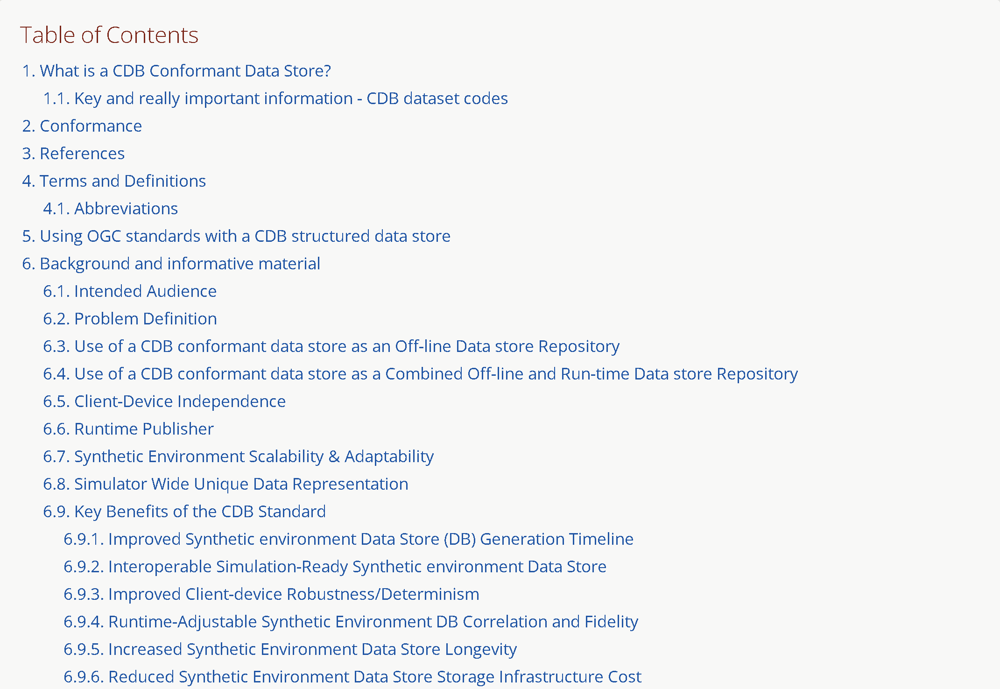
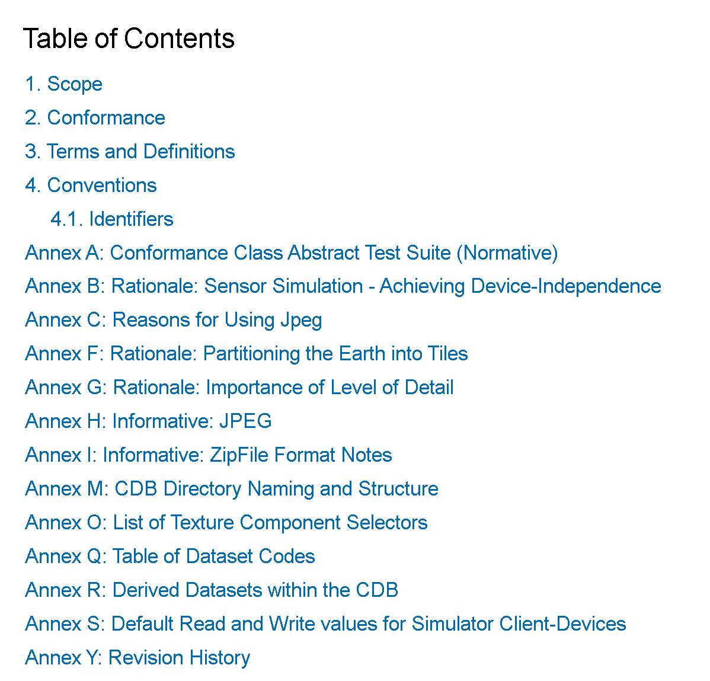

[appendix]
:appendix-caption: Annex
== All Volumes Table of Contents

[red]#*_Placeholder# for a consolidated TOC from all volumes that will be created after all the volumes reach their 'ready for adoption' status since some things like section and paragraph numbers are generated in the final conversion_*

Volume 0:  OGC CDB Companion Primer for the CDB standard (Best Practice)

image::images/Vol0TOCP2.png[image,width=600,height=380]

Volume 1:  OGC CDB Core Standard:  Model and Physical Data Store Structure (Normative)

Volume 2:  OGC CDB Core Model and Physical Structure Annexes (Best Practice)

Volume 3:  OGC CDB Terms and Definitions (Normative)

Volume 4:  OGC CDB Rules for Encoding CDB Vector Data using Shapefiles (Best Practice)

Volume 5:  OGC CDB Radar Cross Section  (RCS) Models (Best Practice)

Volume 6:  OGC CDB Rules for Encoding Data using OpenfFlight (Best Practice)